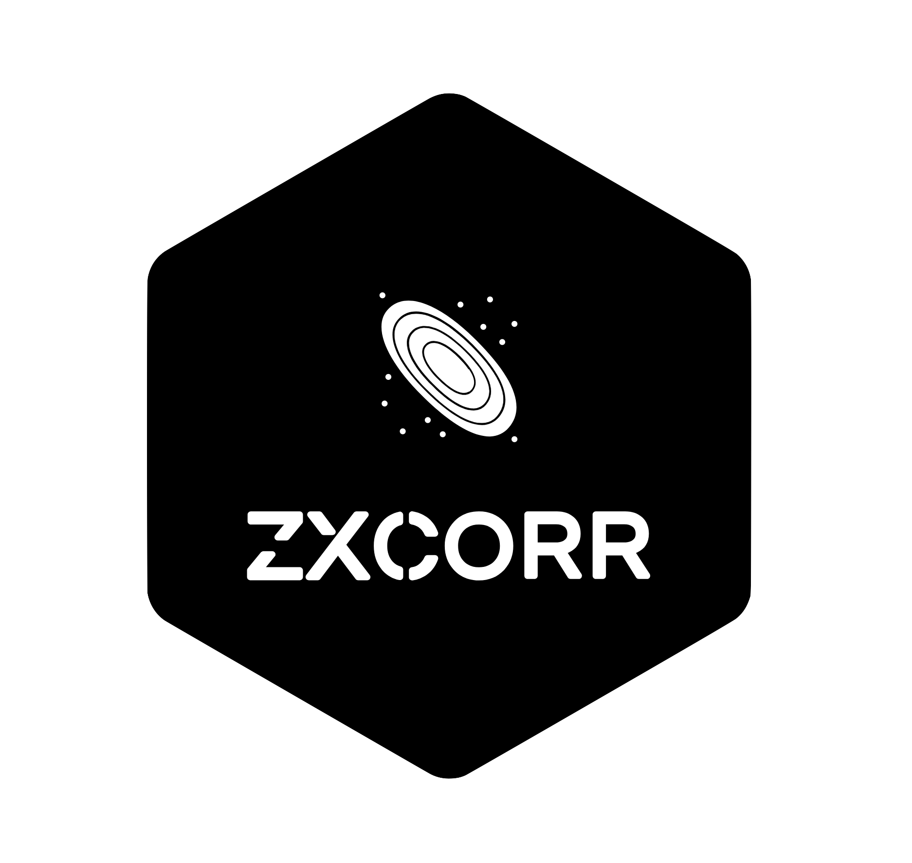

# ZXcorr 

This repository was created by Filipe Abdalla, Alessandro Marins, Priscila e Rafael M. Ribeiro(University of Sao Paulo). Here you will found data from DES, Pan-STARRS. Also we provide some codes,notebooks and examples.

It is owned by BINGO Telescope and [ZXcorr](https://zxcorr.github.io/). Any question about your operation, please, contact us in alessandro.marins@usp.br and rafaelmgr@usp.br.

## Examples in Colab
- Open the executable version of code using [Google Colab](http://colab.research.google.com): 